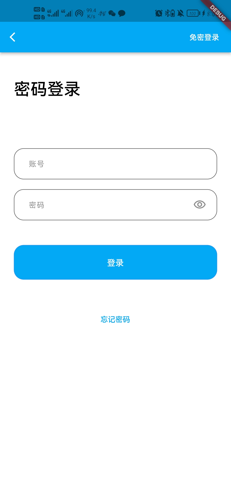
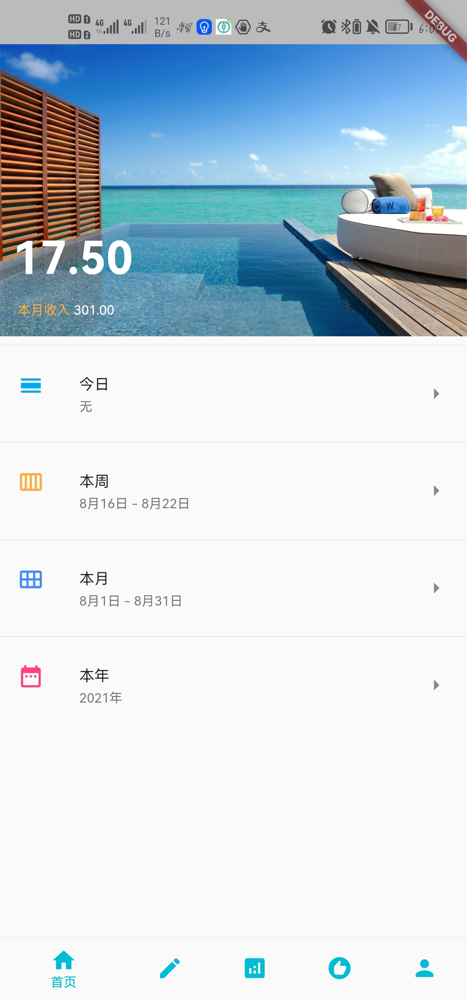
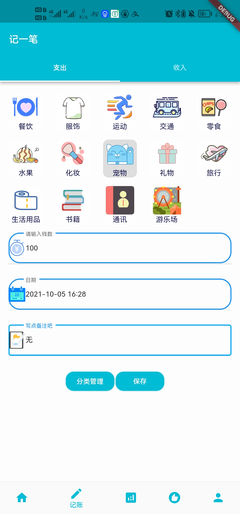
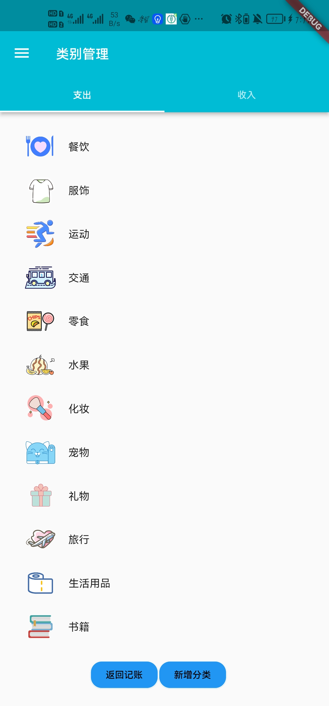
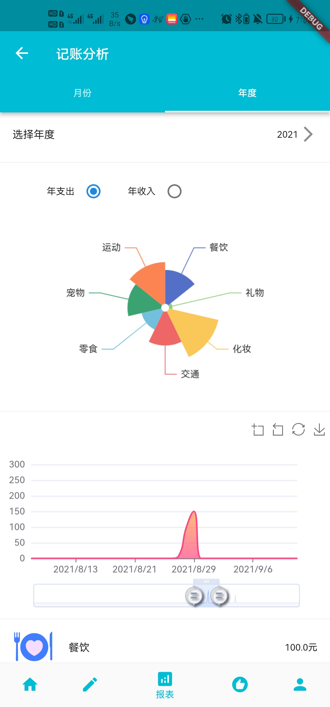
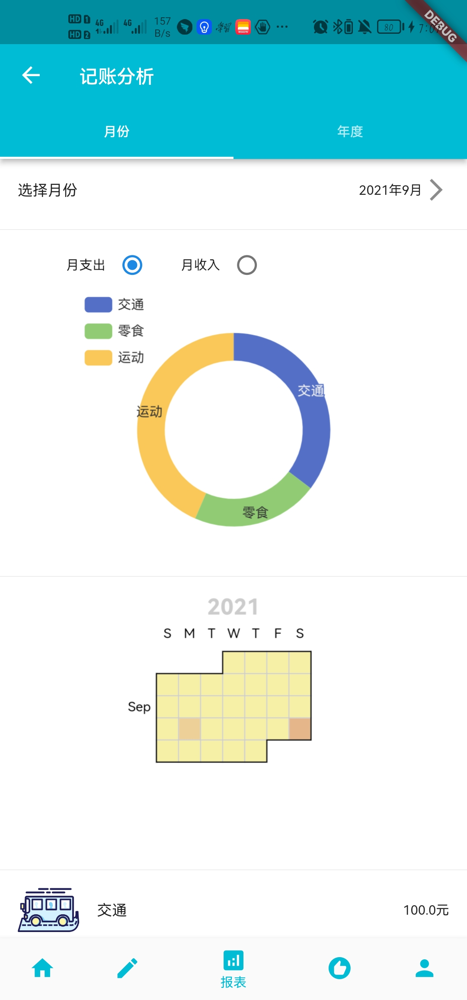
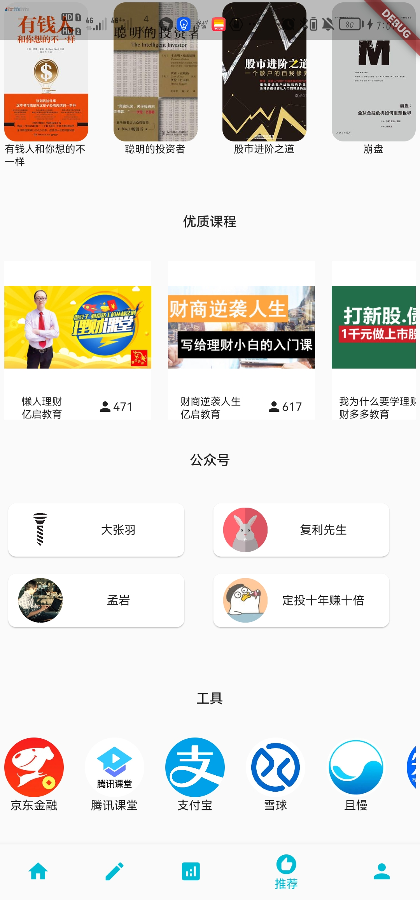
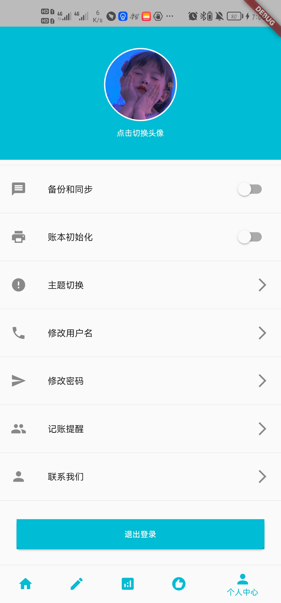

[toc]

# flutter_bookkeeping

## 说明

对于大学生可视化记账分析APP共设置五个板块，分别为登录模块、记账模块、推荐板块、数据管理模块、设置模块。对于登录模块，使用免密登录和密码登录两种方式，绑定邮箱登录，登录之后直接进入主页面；对于记账模块，对应APP中记账，主要有编辑账目、记账查询、账目分类、账目记录、年、月度记账关于收入支出的可视分析、语音输入、消费数据导出、生成消费报告、记账提醒等功能，记账板块主要主要负责收入和支出的记录；推荐模块对应APP中的推荐，针对已经使用的用户，根据使用情况，进行分析后，对应到浏览情况，可以使用相关的推荐算法，对用户进行相关的理财知识的推荐；针对新用户：使用相关爬虫技术，对互联网理财知识进行数据挖掘，利用机器学习算法将得到的结果进行分类整理后，得到用户评价较高、具有推荐价值的课程、公众号、网站、书籍提供给新用户，保证了新用户接收的信息可利用价值；数据管理模块，主要负责数据库相关信息，主要负责账本历史记录、账本管理、分类管理、图片管理、个人信息管理等于数据相关的功能；设置板块，负责基本设置和本APP的特色功能相关设置，如主题设置、账本初始化、备份和同步、头像管理、账本分享、通知管理、权限管理等，也有软件保护和求助反馈等APP设置。

## 设计思路

1. 利用React Native进行环境搭建，集成现有的原生应用
2.  前后端分离式开发，基本逻辑处理和UI框架设计 
3. 基于云端的PolarDB MySQL云原生数据库的存储和设计
4. 相关流畅式交互体验开发极其设计 
5. 图表可视化的展示和生成分析指定报告
6.  语音识别模型训练和模型生产

## 设计的重点难点

1.  使用python实现推荐算法：我们的推荐部分的优质课程、书籍、公众号、工具等都来源于网络，分析统计，并且结合推荐算法，针对新旧用户提供方案
2. 可视化图表实现方式：不同于传统的折线图和饼图，我们拓展图形的种类，提供更为直观新颖的可视化方式。 
3. 服务器选型和数据隐私、安全备份：保证数据的安全性。

## 页面展示

  

 </dev>

 </dev>

 </dev>

